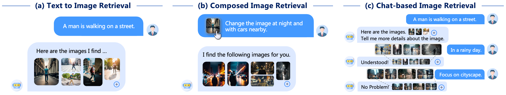
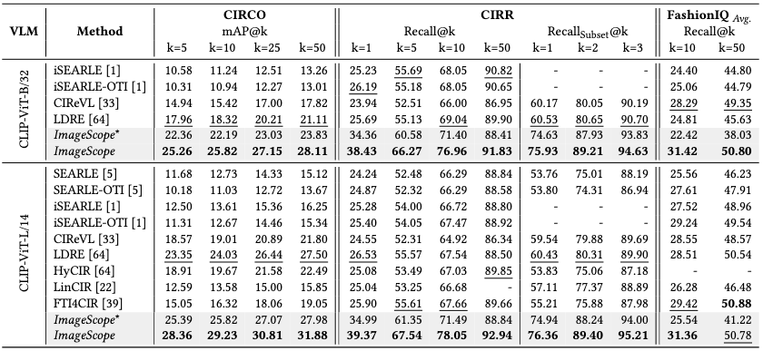
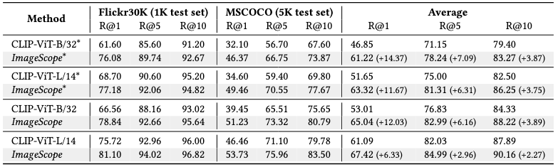

<div align="center">
  <p><b><span style="font-size:2em;">👀 ImageScope 👀</span></b></p>
</div>

<div align="center">
  <p><b>Unifying Language-Guided Image Retrieval via Large Multimodal Model Collective Reasoning</b></p>
</div>


<div align="center">
  <p>Accepted at WWW 2025</p>
   <a href="https://arxiv.org/abs/2503.10166">
    
  </a>
</div>


<div align="center">
  <p>
    Pengfei Luo<sup>†</sup>,
    Jingbo Zhou<sup>‡</sup>,
    Tong Xu<sup>†</sup>,
    Yuan Xia<sup>‡</sup>,
    Linli Xu<sup>†</sup>,
    Enhong Chen<sup>†</sup>
  </p>
  
  <p>
    <sup>†</sup> University of Science and Technology of China<br>
    <sup>‡</sup> Baidu Inc  
  </p>
</div>



[](https://paperswithcode.com/sota/zero-shot-text-to-image-retrieval-on-1?p=imagescope-unifying-language-guided-image-1)
[](https://paperswithcode.com/sota/zero-shot-text-to-image-retrieval-on-ms-coco-1?p=imagescope-unifying-language-guided-image-1)
[](https://paperswithcode.com/sota/chat-based-image-retrieval-on-visdial?p=imagescope-unifying-language-guided-image-1)
[](https://paperswithcode.com/sota/zero-shot-composed-image-retrieval-zs-cir-on-2?p=imagescope-unifying-language-guided-image-1)
[](https://paperswithcode.com/sota/zero-shot-composed-image-retrieval-zs-cir-on?p=imagescope-unifying-language-guided-image-1)
[](https://paperswithcode.com/sota/zero-shot-composed-image-retrieval-zs-cir-on-1?p=imagescope-unifying-language-guided-image-1)


# 🚀 Setup

## Environment

Create virtual environment:
```bash
conda create -n ImageScope python=3.10.14
conda activate ImageScope
```

Install Pytorch
```bash
pip install torch==2.4.0 torchvision==0.19.0 --index-url https://download.pytorch.org/whl/cu118
```

Install other libraries:
```bash
pip install xformers==0.0.27.post2 --index-url https://download.pytorch.org/whl/cu118
pip install https://github.com/vllm-project/vllm/releases/download/v0.5.4/vllm-0.5.4+cu118-cp310-cp310-manylinux1_x86_64.whl
pip install -r requirements.txt
```

## Datasets

Put all dataset in a folder `data` as follows:
```shell
./data
├── CIRCO
├── CIRR
├── FashionIQ
├── Flickr30K
├── MSCOCO
└── VisDial
```

### CIRCO
Please follow the instruction of the CIRCO official repository
[miccunifi/CIRCO](https://github.com/miccunifi/CIRCO?tab=readme-ov-file#download) to prepare the dataset.


Move the folder `unlabeled2017` and the folder `CIRCO` structure should look like:
```shell
./CIRCO
├── captions
│   ├── val.json
│   └── test.json
└── unlabeled2017
    ├── 000000572834.jpg
    ├── 000000088597.jpg
    ├── 000000386336.jpg
    ├── ...
```

### CIRR
Please follow the instruction of the CIRR official repository [Cuberick-Orion/CIRR](https://github.com/Cuberick-Orion/CIRR?tab=readme-ov-file#download-cirr-dataset) to prepare the dataset.

Make the folder `CIRR` structure looks as follows:
```shell
./CIRR
├── LICENSE
├── README.md
├── captions_ext
│   ├── cap.ext.rc2.test1.json
│   ├── cap.ext.rc2.train.json
│   ├── cap.ext.rc2.val.json
├── image_splits
│   ├── split.rc2.val.json
│   ├── split.rc2.train.json
│   ├── split.rc2.test1.json
├── dev
│   ├── dev-841-3-img0.png
│   ├── dev-30-2-img1.png
│   ├── dev-954-2-img1.png
│   ├── ...
├── captions
│   ├── cap.rc2.train.json
│   ├── ._cap.rc2.val.json
│   ├── cap.rc2.val.json
│   ├── ...
└── test1
    ├── test1-1005-3-img0.png
    ├── test1-400-0-img1.png
    ├── test1-718-0-img0.png
    ├── ...
```

### FashionIQ

Download and extract files form 🤗[HuggingFace - Plachta/FashionIQ](https://huggingface.co/datasets/Plachta/FashionIQ), and organize the folder `FashionIQ` like:
```shell
./FashionIQ
├── image_splits
│   ├── split.dress.val.json
│   ├── split.toptee.val.json
│   ├── split.dress.train.json
│   ├── ...
├── captions
│   ├── cap.shirt.test.json
│   ├── cap.shirt.val.json
│   ├── cap.toptee.test.json
│   ├── ...
└── images
    ├── B0088D23WY.png
    ├── B000QB12QY.png
    ├── B001I90CD2.png
    ├── ...
```

### Flickr30K

Download and extract files form 🤗[HuggingFace - nlphuji/flickr_1k_test_image_text_retrieval](https://huggingface.co/datasets/nlphuji/flickr_1k_test_image_text_retrieval), and organize the folder `Flickr30K` like:
```shell
./Flickr30K
├── README.md
├── test_1k_flickr.csv
├── images_flickr_1k_test.zip
├── test_1k_flickr.csv
└── images
    ├── 2847514745.jpg
    ├── 4689169924.jpg
    ├── 2088705195.jpg
    ├── ..
```

### MSCOCO


Download and extract files form 🤗[HuggingFace - nlphuji/mscoco_2014_5k_test_image_text_retrieval](https://huggingface.co/datasets/nlphuji/mscoco_2014_5k_test_image_text_retrieval), and organize the folder `MSCOCO` like:
```shell
./MSCOCO
├── README.md
├── test_5k_mscoco_2014.csv
├── mscoco_2014_5k_test_image_text_retrieval.py
├── images_mscoco_2014_5k_test.zip
├── .gitattributes
└── images
    ├── COCO_val2014_000000466052.jpg
    ├── COCO_val2014_000000335631.jpg
    ├── COCO_val2014_000000297972.jpg
    ├── ...
```

### VisDial


Obtain `Protocal/Search_Space_val_50k.json` and `dialogues/VisDial_v1.0_queries_val.json` from the [Saehyung-Lee/PlugIR](https://github.com/Saehyung-Lee/PlugIR/) repository. Download the images [COCO 2017 Unlabeled Images](http://images.cocodataset.org/zips/unlabeled2017.zip). Place the downloaded files in the folder `VisDial` and organize it as follows:
```text
./VisDial
├── Search_Space_val_50k.json
├── VisDial_v1.0_queries_val.json
└── unlabeled2017
    ├── 000000572834.jpg
    ├── 000000088597.jpg
    ├── 000000386336.jpg
    ├── ...
```

Once you have completed these steps, your dataset is ready for use.

## Models

Download the pre-trained model weights from the links provided below. 

| **Role**      | **Model**                  | **Link**                      |
|---------------|---------------------------------|---------------------------------------|
| **Captioner** | LLaVA-v1.6-vicuna-7B            | 🤗[llava-hf/llava-v1.6-vicuna-7b-hf](https://huggingface.co/llava-hf/llava-v1.6-vicuna-7b-hf)      |
| **Reasoner**  | LLaMA3-8B-Instruct              | 🤗[meta-llama/Meta-Llama-3-8B-Instruct](https://huggingface.co/meta-llama/Meta-Llama-3-8B-Instruct)   |
| **Verifier**  | PaliGemma-3B-mix-224             | 🤗[google/paligemma-3b-mix-224](https://huggingface.co/google/paligemma-3b-mix-224)           |
| **Evaluator** | InternVL2-8B                    | 🤗[OpenGVLab/InternVL2-8B](https://huggingface.co/OpenGVLab/InternVL2-8B)               |
| **VLM**       | CLIP-ViT-L-14-laion2B-s32B-b82K | 🤗[laion/CLIP-ViT-L-14-laion2B-s32B-b82K](https://huggingface.co/laion/CLIP-ViT-L-14-laion2B-s32B-b82K) |

You can place the downloaded weights in a directory of your choice, and specify the path to the models in the configuration or script when running the pipeline. 


# 📏 Inference and Evaluation

## Inference
To run inference on a specific dataset, modify the model path in the corresponding script located in the `script/run_{dataset_name}.sh` folder. Replace the placeholder with your actual model path. Once updated, execute the script using the command `bash script/run_{dataset_name}.sh` to initiate the inference process.

By default, the script utilizes **all available GPUs**. If you wish to restrict GPU usage, manually configure the `CUDA_VISIBLE_DEVICES` environment variable. On the first run, the pipeline will automatically create an `image_db` directory to store image captions and embeddings for retrieval purposes.

Note: For the CIRR subset setting, you need to include the `--subset` flag in the command within the script.


## Evaluation
After completing the inference, evaluation metrics (for FashionIQ, Flickr30K, MSCOCO, and VisDial) or submission files (for CIRCO and CIRR) can be found in the `runs` folder. Metrics are logged in files located at `runs/{dataset_name}/{runs_name}/{clip_version}-{timestamp}/output.log`, while prediction results are saved as JSON files at `runs/{dataset_name}/{runs_name}/{clip_version}-{timestamp}/{timestamp}_{dataset_name}_test_stage3_eval.json`. You can submit these JSON files to the [CIRR Evaluation Server](https://cirr.cecs.anu.edu.au/) or [CIRCO Evaluation Server](https://circo.micc.unifi.it/) to obtain the final evaluation results.

## Experimental Results






# 📚 Citation
If you find our paper and code are useful in your research, please cite it as follows: 
```bibtex
@inproceedings{luo2025imagescope,
  title={ImageScope: Unifying Language-Guided Image Retrieval via Large Multimodal Model Collective Reasoning},
  author={Luo, Pengfei and Zhou, Jingbo and Xu, Tong and Xia, Yuan and Xu, Linli and Chen, Enhong},
  booktitle={The Web Conference 2025},
  year={2025}
}
```